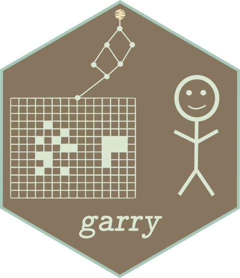
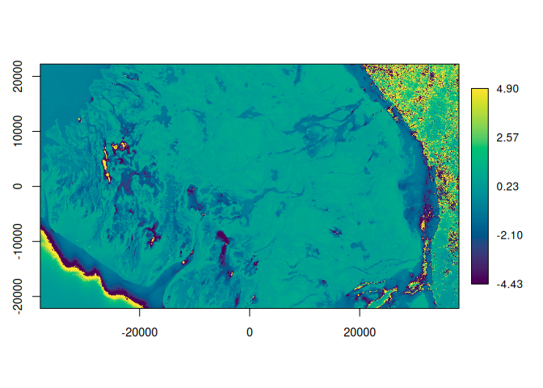
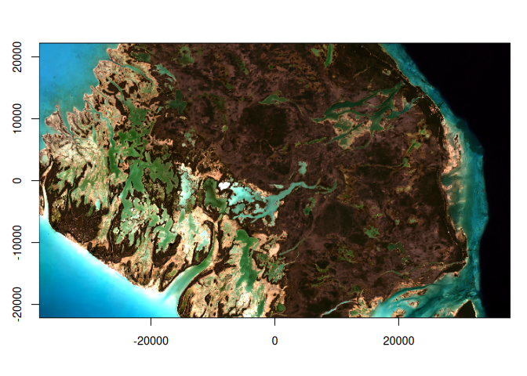
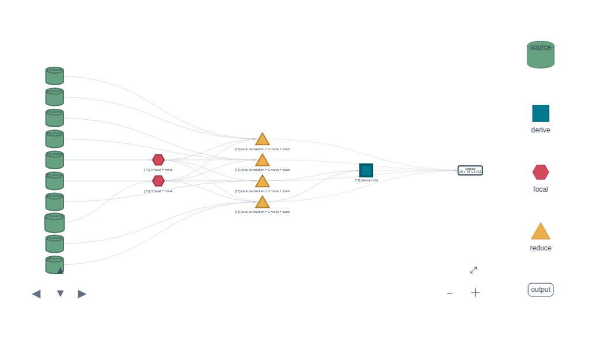

<!-- README.md is generated from README.Rmd. Please edit that file -->

# garry <a href="https://belian-earth.github.io/garry/"></a>

<!-- badges: start -->

[](https://github.com/belian-earth/garry/actions/workflows/R-CMD-check.yaml)
[](https://lifecycle.r-lib.org/articles/stages.html#experimental)
[](https://app.codecov.io/gh/belian-earth/garry)
<!-- badges: end -->

> [!WARNING]
> garry is experimental and under active development. The API changes
> without deprecation: function signatures and behaviour may differ
> between commits, and nothing here should be treated as stable yet.
> Development and benchmarking happen on Linux; macOS is CI-tested but
> less exercised, and there is a known issue with the fused execution
> path on Apple Silicon. Performance and behaviour there are not yet
> fully characterised.

garry is a lazy, spatial-aware raster engine for R. You describe a whole
raster computation as a graph and it runs it fast: chunked, distributed
across processes, with the numeric kernels JIT-compiled to XLA (CPU or
GPU).

**What it is:**

- **Lazy.** Every operation (`lazy_map()`, `focal()`, `reduce_over()`,
  `mask()`, `align()`) adds a node to a computation graph and returns
  immediately. Nothing reads or computes until `collect()`.
- **Spatial-aware.** Arrays carry their CRS, transform and extent.
  Alignment is explicit: binary ops never silently resample, so a pixel
  is never quietly moved half a cell.
- **Fast.** `collect()` plans the graph into chunks, streams reads
  through a GDAL daemon pool, and runs the fused kernels through
  [anvl](https://github.com/r-xla/anvl) (XLA). On a three-band annual
  HLS composite it matches Python’s ODC + dask on the same machine, in
  idiomatic R.
- **GDAL-faithful.** IO is
  [gdalraster](https://cran.r-project.org/package=gdalraster).

## Scope

garry is a raster-algebra compiler, not a GIS. It provides a small,
closed set of array primitives (elementwise map, focal stencils,
reductions, scans along time, whole-window model kernels; fixed-point
iteration is planned) over grid-pinned labelled cubes. Expressions are
written in [anvl](https://github.com/r-xla/anvl)’s vocabulary, planned
as one graph, and executed distributed and memory-bounded. This closed
world is what makes whole-graph fusion, cost placement and
byte-identical distributed execution possible.

On those primitives garry ships a growing catalogue of statistical
verbs: `geomedian()` and `medoid()` for multivariate compositing,
`kalman_smooth()` and `hampel_smooth()` for time series, `ocm_mask()`
for learned cloud masking. Each is an ordinary composition in the same
public vocabulary available to every user (a reducer body, a scan body,
a focal or model kernel) with no privileged access to the engine, so
anything garry ships, a script or downstream package can equally write.
A verb earns its place by being useful across earth-observation
pipelines and verifiable against a reference implementation;
domain-specific analysis belongs downstream. When something genuinely
cannot be expressed, that is the signal for a deliberate, rare extension
of the primitive set, which is exactly how scans, band-time cubes, and
model kernels arrived.

GDAL is the only boundary. The warper is the universal ingest and
reshape mechanism (reprojection, resolution change, mosaicking);
materialisation is the exit. Vector interop, dynamic-shape outputs and
format conversion belong to GDAL at that boundary, not to the engine.

## Installation

You can install the development version of garry from
[GitHub](https://github.com/) with:

``` r
# install.packages("pak")
pak::pak("belian-earth/garry")
```

garry computes through [anvl](https://github.com/r-xla/anvl)/XLA, whose
PJRT runtime plugin downloads on first use. Fetch it once up front (it
prompts interactively otherwise, which fails in scripts and on servers):

``` r
pjrt::install_pjrt()               # CPU plugin (~250 MB unpacked, cached per user)
# pjrt::install_pjrt(cuda = TRUE)  # instead, for a CUDA-capable GPU
```

garry also needs GDAL \>= 3.9 on the system (the GTI mosaic driver
behind `lazy_dataset()`); `gdalraster` reports yours with
`gdalraster::gdal_version()`.

## Example

A cloud-masked annual median composite of HLS Sentinel-2 imagery,
straight from the Microsoft Planetary Computer. The whole pipeline is
lazy: it reads and computes only at the final `collect()`.

``` r
library(garry)
#> garry: GDAL 3.13.0 "Iowa City", released 2026/05/04

# 1. Discover: HLS S30 over an AOI, Jan-March of 2023, pre-signed for the PC.
aoi <- c(-78.4, 24.4, -77.65, 24.8)   # lon/lat bounding box
src <- stac_query(
  bbox        = aoi,
  stac_source = "https://planetarycomputer.microsoft.com/api/stac/v1/",
  collection  = "hls2-s30",
  start_date  = "2023-01-01", 
  end_date = "2023-03-31"
) |>
  stac_sign_mpc() |> 
  stac_filter_cloud(30) |> 
  stac_filter_assets(c("B04", "B03", "B02", "B08", "Fmask"))


# 2. The analysis grid, straight from the AOI: an equal-area (LAEA) grid at 30 m
#    centred on the bbox. No hand-picked EPSG or projected extent.
target <- grid_from_bbox(aoi, res = 30)

# 3. A read/compute daemon pool, auto-sized to the machine.
garry_daemons()

# 4. Build the pipeline. A `LazyDataset` holds every band over time; the verbs
#    apply across all bands at once. Still nothing has been read or computed.
composite <- lazy_dataset(
  src, 
  grid = target,
  assets = c("B04", "B03", "B02", "B08"), 
  mask_asset = "Fmask",
  nodata = c(B04 = -9999, B03 = -9999, B02 = -9999, B08 = -9999, Fmask = 255),
  scale = TRUE,   # apply each file's TIFF scale/offset tags on read -> reflectance
  resampling = "bilinear"
) |>
  mask(where = qa_bits(0:3), open = 2, dilate = 3) |>  # clouds/shadows + cleanup
  reduce_over("median", over = "t")       # per-band temporal median

# A derived band is just more graph: NDVI from the NIR/red composites. It joins
# the lazy pipeline like any other band, computed only at the final collect().
composite[["ndvi"]] <- (composite[["B08"]] - composite[["B04"]]) /
  (composite[["B08"]] + composite[["B04"]])

# Inspect the pipeline before running anything. print() summarises the dataset
# (bands + grid); draw() renders the IR: a LazyDataset as its ordered pipeline
# steps, a single band as its node tree.
print(composite)
#> ── <LazyDataset> ───────────────────────────────────────────────────────────────
#>   bands  B04 B03 B02 B08 ndvi
#>   time   15 slices
#>   grid   2536 x 1480 • f32
#>   crs    Lambert Azimuthal Equal Area
#>   graph  206 nodes • lazy
#>   ℹ draw(x) to see the pipeline
draw(composite)              # the dataset's pipeline steps
#> ── <LazyDataset> pipeline ──────────────────────────────────────────────────────
#>   ◈ source    B04 B03 B02 B08 ndvi  •  15 slices • 2536×1480 f32
#>   ✕ mask      from Fmask • bits 0–3 • open 2 • dilate 3
#>   ▸ reduce    median over t
#>   ⊕ derive    ndvi
#>   ─ 206 nodes • crs Lambert Azimuthal Equal Area
draw(composite[["ndvi"]])    # the NDVI band's node tree
#> ── <LazyRaster> 2536 x 1480 • f32 ──────────────────────────────────────────────
#> ƒ map  (2 inputs)
#> └─ ƒ map  (2 inputs)  ×2
#>    └─ ▸ median  over t  ×2
#>       └─ ⬚ stack  along t
#>          └─ ƒ map  (2 inputs)  ×15
#>             ├─ ◈ source  2536×1480 f32
#>             └─ ◫ focal  r=3
#>                └─ ◫ focal  r=2
#>                   └─ ◫ focal  r=2
#>                      └─ ƒ map
#>                         └─ ◈ source  2536×1480 f32

# preview() estimates a coarse grid from the graph and device, runs the pipeline
# at that reduced resolution (reading only overviews / the windows it needs), and
# plots the result -- a cheap look before committing to the full collect().
preview(composite[["ndvi"]])   # single band -> colour ramp + colourbar
```



``` r

# 5. Execute across the daemons. collect() returns a (y, x, band) array carrying
#    a `gis` attribute (extent/CRS), so the result is self-describing.
a <- collect(composite)

# preview() on a materialised array reads that `gis` attribute for real-world axes.
preview(a)     # multi-band  -> RGB (first three bands)
```



The plan itself is worth looking at. `plan_view()` renders it as an
interactive DAG (static here; live in RStudio and on the pkgdown site):
stages typed by what they compute, provenance on hover (assets,
acquisition dates, reducers), and dashed edges where bands pass through
into the output. It shows the schedule you cannot see from the code:
each QA slice’s mask predicate and morphological cleanup run as their
own focal stages (halo work, kept narrow); each band’s masking, time
stack, and median fuse into a single stage; and NDVI derives in its own
stage before the write.

``` r
plan_view(composite)
```



See the [Inspecting
plans](https://belian-earth.github.io/garry/articles/inspecting-plans.html)
article for the full visual vocabulary and layout controls.

To write to disk instead, `write_tif()` runs the same plan but streams
each chunk into a GeoTIFF as it lands, so nothing is ever held whole in
memory. `dtype` and `scale` quantise the f32 reflectance back to int16
(half the file size, and the scale is written to the TIFF tags so
readers recover real values); `cog = TRUE` finalises a Cloud-Optimised
GeoTIFF.

``` r
tif <- file.path(tempdir(), "composite.tif")
write_tif(composite, tif,
          dtype = "i16", scale = 0.0001, nodata = -32768, cog = TRUE)
```

The same verbs work on a single raster. `lazy_source()` opens one COG or
a GDAL mosaic; `lazy_map()` / `focal()` / `reduce_over()` build
map-algebra graphs; `align()` reprojects onto a target grid; `collect()`
brings the result into R and `write_tif()` streams it to disk. See
`benchmarks/compare.sh` for the back-to-back garry-vs-ODC benchmark.
